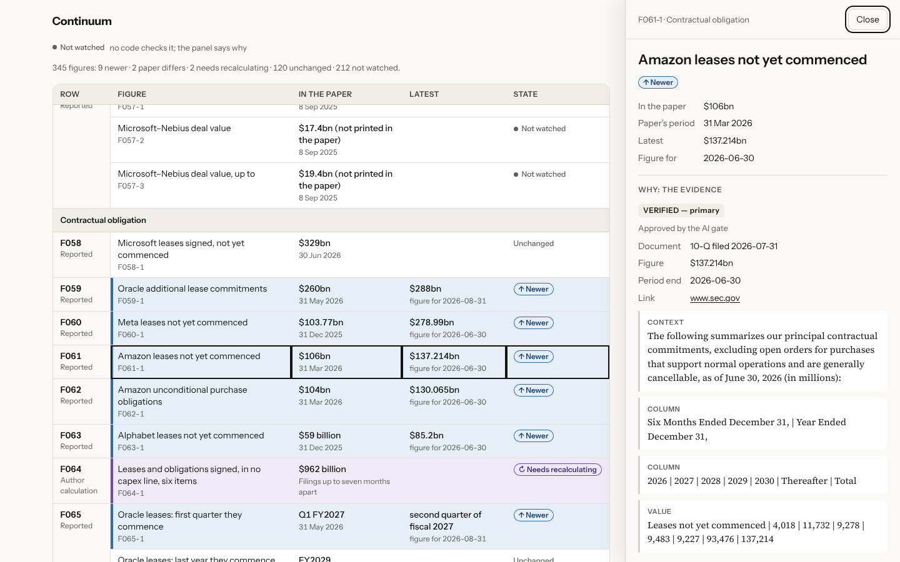
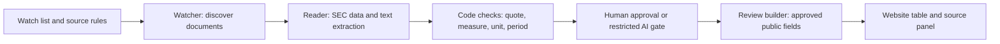

# Continuum research agent

A source-checking pipeline for *The AI Lose Lose Race*: it compares a research paper’s figures with company filings, validates the evidence, records approval decisions and builds the data behind a public review table.

**[See the live review](https://continuum-research.netlify.app/reports/the-ai-lose-lose-race/review/)** · **[Follow one figure through the code](docs/worked-example.md)** · **[Architecture](docs/architecture.md)**



Interface example from a gate presentation test. The dated demo below uses recorded human approvals; this image is not evidence of how those historical decisions were made.

## Try it locally

Python 3.9 or later. The offline demonstration and tests need no API key, network connection or third-party Python packages after cloning.

```sh
git clone https://github.com/sebastianflemingsmith-cmyk/continuum-research-agent.git
cd continuum-research-agent
python3 tools/demo.py
python3 tools/check.py
```

To repeat the demonstration, choose a fresh folder, for example `python3 tools/demo.py --out .local/demo-2`. Existing output is never overwritten.

The demonstration writes `.local/demo/review.json` from a curated historical snapshot and separately replays saved Part B documents and model responses through the real extraction checks. It does **not** fetch current figures or automatically approve replay results. Dates belong to the saved evidence; this is not a claim about the latest financial position today.

`tools/check.py` runs the reader and approvals suites in an isolated temporary workspace. They cover saved-data replays, periods and units, rejected extractions, watcher handoffs, human overrides, approval restrictions and the review’s output allow-list. Both commands block outbound connections. See [live setup](docs/live-use.md) to run the same implementation with your own credentials.

## The problem

A paper contains figures from different dates and sources. A newer filing may change one figure, leave another unchanged and make a derived calculation stale. Finding a number is insufficient: its unit, reporting period and accounting measure must match.

The agent keeps the paper’s original figure beside the approved finding, with its source and evidence. It tracks which calculations depend on that figure. It never edits the paper or models.



## What is implemented

| Component | Responsibility |
|---|---|
| [Watcher](watcher/README.md) | Finds new SEC filings, releases and supported transcripts; records failures and discoveries. |
| [Reader](reader/README.md) | Part A reads labelled SEC data. Part B uses DeepSeek to propose text extractions, then checks evidence in code. |
| [Approvals](approvals/README.md) | Spreadsheet decisions and an optional, restricted AI approval gate; append-only decision history. |
| [Review builder](review/README.md) | Deterministic JSON for the website, with explicit allowed fields and approved evidence only. |
| [Runner probe](runner/README.md) | Checks source access from a proposed host; it is not a deployed update service. |

The AI gate makes a separate model call using the **same configured model** as the reader. This is an additional check, not independent-model verification. It can approve only qualifying newer primary-source figures; human decisions take precedence.

## Scope and limitations

This public edition preserves the pipeline implementation from the October 2026 research project, with curated example data and a reproducible local setup. It is built for this paper and its explicit claim rules, not arbitrary reports. Some figures are deliberately not watched; the table states why. Source access can fail, and a checked quotation does not by itself prove that every interpretation is correct.

The website is a static view of approved research. A one-click update button, scheduled end-to-end runs and a conversational explanation service are not implemented. The live website may be newer than this dated example.

Python’s standard library handles the core pipeline and offline tests. Live PDF extraction additionally uses `pypdf`. Browser presentation checks use Playwright separately from the Python suites. DeepSeek access is needed only for new model calls.

## My contribution and AI assistance

Sebastian Fleming Smith defined the research problem, selected the sources, specified the evidence and approval rules, checked findings against the paper and directed the product and review interface. Claude Code assisted with the original implementation and tests. Codex assisted with the public repository’s curation, documentation and verification.

The project demonstrates how those research requirements become explicit rules, inspectable evidence and regression tests. The code and worked example let a reviewer examine that process directly.

## Explore further

- [Worked example](docs/worked-example.md): a filing → extraction → approval → published figure.
- [Architecture](docs/architecture.md): modules, trust boundaries and reproducibility.
- [Live use](docs/live-use.md): independent runtime and credential setup.
- [Maintenance](docs/maintenance.md): updating code and curating new snapshots.
- [Security](SECURITY.md): credentials and publication boundaries.
- [Verification](docs/verification.md): regression results and reproduction limits.

No software licence grant is assumed by this repository; source documents retain their respective rights.
